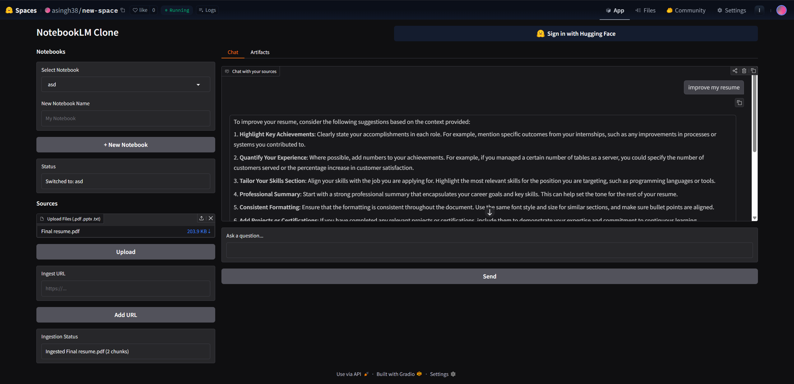
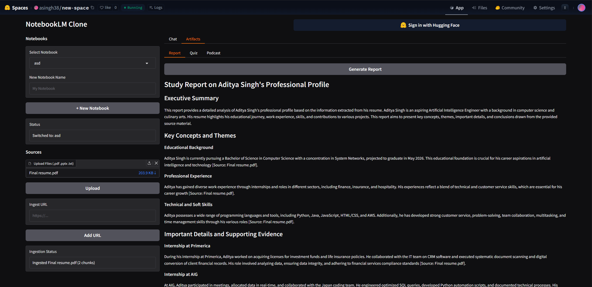
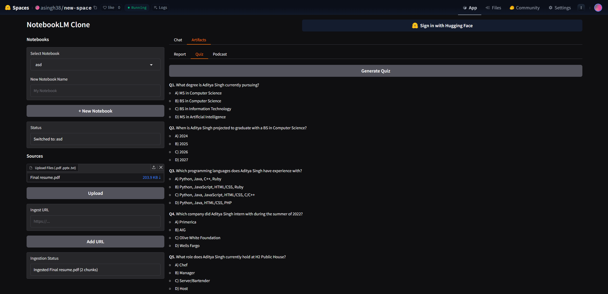
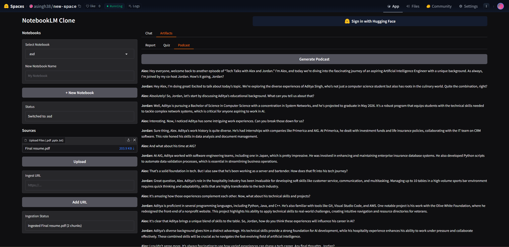

---

## Features

- **Multi-notebook support** — create, switch between, and manage multiple notebooks
- **Source ingestion** — upload PDF, PPTX, and TXT files, or paste any web URL
- **RAG Chat** — ask questions about your sources and get cited, grounded answers
- **Artifact generation**
  - Report — a comprehensive markdown study guide
  - Quiz — multiple choice questions with an answer key
  - Podcast — a two-host conversation script with audio playback
- **Persistent storage** — notebooks, chats, and artifacts are saved across sessions

---

## Tech Stack

| Layer | Technology |
|---|---|
| Frontend | [Gradio](https://gradio.app) |
| LLM | [OpenAI GPT-4o](https://platform.openai.com) |
| Vector DB | [ChromaDB](https://trychroma.com) |
| PDF parsing | PyPDF2 |
| PPTX parsing | python-pptx |
| Web scraping | BeautifulSoup4 + requests |
| Text to Speech | OpenAI TTS |

---

## Project Structure

```
notebooklm-clone/
├── app.py                  # Gradio UI and event wiring
├── backend/
│   ├── ingest.py           # File & URL ingestion, chunking, embedding
│   ├── retrieval.py        # ChromaDB vector search
│   ├── chat.py             # RAG chat with source citations
│   └── artifacts.py        # Report, quiz, and podcast generation
├── data/                   # Runtime user data (gitignored)
│   └── users/
│       └── <username>/
│           └── notebooks/
│               └── <notebook-id>/
│                   ├── files_raw/
│                   ├── files_extracted/
│                   ├── chroma/
│                   ├── chat/messages.jsonl
│                   └── artifacts/
├── requirements.txt
├── .env.example
└── README.md
```

---

## Setup

### Prerequisites

- Python 3.10+
- An OpenAI API key — get one at [platform.openai.com](https://platform.openai.com)

### Installation

1. **Clone the repository**
   ```bash
   git clone https://github.com/4681Project/notebooklm-clone
   cd notebooklm-clone
   ```

2. **Create and activate a virtual environment**
   ```bash
   python -m venv venv
   source venv/bin/activate        # Mac/Linux
   venv\Scripts\activate           # Windows
   ```

3. **Install dependencies**
   ```bash
   pip install -r requirements.txt
   ```

4. **Set up environment variables**
   ```bash
   cp .env.example .env
   ```
   Open `.env` and add your API key:
   ```
   OPENAI_API_KEY=sk-...
   ```

5. **Run the app**
   ```bash
   python app.py
   ```
   The app will be available at `http://localhost:7860`

---

## Environment Variables

| Variable | Required | Description |
|---|---|---|
| `OPENAI_API_KEY` | Yes | Your OpenAI API key for LLM and TTS calls |

---

## Team & Module Ownership

| Person | Module | File |
|---|---|---|
| Person 1 | Gradio UI | `app.py` |
| Person 2 | Ingestion pipeline | `backend/ingest.py` |
| Person 3 | RAG + ChromaDB | `backend/retrieval.py` |
| Person 4 | Chat + citations | `backend/chat.py` |
| Person 5 | Artifact generation | `backend/artifacts.py` |

---

## Contributing

We use a feature-branch workflow. Please do **not** push directly to `main`.

```bash
# 1. Pull the latest main
git checkout main
git pull origin main

# 2. Create a feature branch
git checkout -b feature/your-feature-name

# 3. Make your changes, then commit
git add .
git commit -m "Short description of what you changed"

# 4. Push your branch
git push origin feature/your-feature-name

# 5. Open a Pull Request on GitHub and request a review
```

---

## Architecture Overview

```
User
 │
 ▼
Gradio UI (app.py)
 │
 ├──► Ingest ──► Extract text ──► Chunk ──► Embed ──► ChromaDB
 │
 ├──► Chat ──► Retrieve top-k chunks ──► Prompt LLM ──► Response + citations
 │
 └──► Artifacts ──► Retrieve chunks ──► Prompt LLM ──► Report / Quiz / Podcast
```

---
---

## Demo






---

## License

MIT
